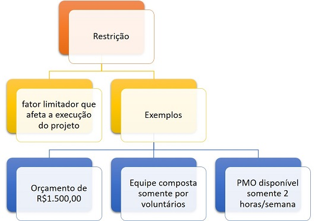

# Requisitos

_**Cascata VS Ágil**_

<figure><figcaption></figcaption></figure>



_Cascata_ -> tempo de entrega, entrega no final apenas

* Faz por partes (requisitos, design...)

_Ágil_ -> entregas parciais, o cliente entende mais fácil devido as entregas

* Faz por entregas(o cliente participa mais, verifica uma parte e depois de feita, vê a próxima...)

_**Contextualização SCRUM**_

<figure><figcaption></figcaption></figure>

<figure><figcaption></figcaption></figure>

* SCRUM/SPRINT -> Levantar requisitos, produzir, testar e validar

<figure><figcaption></figcaption></figure>





* **Passo a passo SCRUM:**



_**Definição de Requisitos**_



Os requisitos de software podem ser entendidos como as necessidades e expectativas dos usuários e outras partes interessadas em relação ao sistema que está sendo desenvolvido. Eles definem o que o sistema deve fazer, como ele deve se comportar e quais são os seus limites e restrições.

_Resumindo, são as funcionalidades do software, ações que o software deve executar, possuindo características e condições próprias..._

